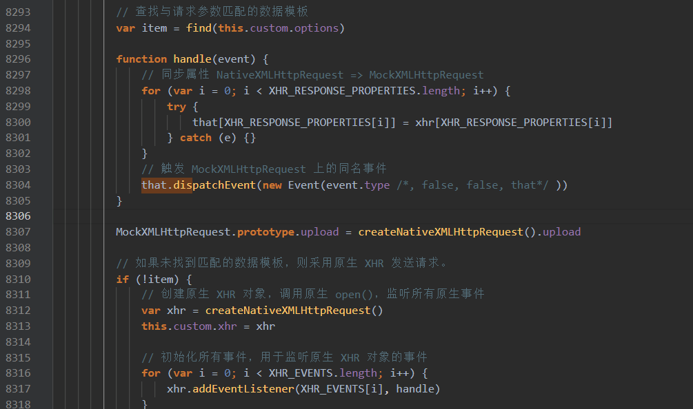

# Nuxt爬坑

## 第一节：nuxt.js相关概述

> nuxt.js简单的说是Vue.js的通用框架，最常用的就是用来作SSR（服务器端渲染）.Vue.js是开发SPA（单页应用）的,Nuxt.js这个框架，用Vue开发多页应用，并在服务端完成渲染，可以直接用命令把我们制作的vue项目生成为静态html。

### 1.那服务器端渲染到底有什么好处呢？

> 主要的原因时SPA（单页应用）不利于搜索引擎的SEO操作，Nuxt.js适合作新闻、博客、电影、咨询这样的需要搜索引擎提供流量的项目。如果你要作移动端的项目，就没必要使用这个框架了。

### 2.什么是SSR？

>  在认识SSR之前，首先对CSR与SSR之间做个对比。
>  
> 首先看一下传统的web开发，传统的web开发是，客户端向服务端发送请求，服务端查询数据库，拼接HTML字符串（模板），通过一系列的数据处理之后，把整理好的HTML返回给客户端,浏览器相当于打开了一个页面。这种比如我们经常听说过的jsp,PHP,aspx也就是传统的MVC的开发。
> 
> SPA应用，到了Vue、React，单页面应用优秀的用户体验，逐渐成为了主流，页面整体式javaScript渲染出来的，称之为客户端渲染CSR。SPA渲染过程。由客户端访问URL发送请求到服务端，返回HTML结构（但是SPA的返回的HTML结构是非常的小的，只有一个基本的结构，如第一段代码所示）。客户端接收到返回结果之后，在客户端开始渲染HTML，渲染时执行对应javaScript，最后渲染template，渲染完成之后，再次向服务端发送数据请求，注意这里时数据请求，服务端返回json格式数据。客户端接收数据，然后完成最终渲染。
> 
> SPA虽然给服务器减轻了压力，但是也是有缺点的：
> 1.首屏渲染时间比较长：必须等待JavaScript加载完毕，并且执行完毕，才能渲染出首屏。
> 2.SEO不友好：爬虫只能拿到一个div元素，认为页面是空的，不利于SEO。
> 
> 为了解决如上两个问题，出现了SSR解决方案，后端渲染出首屏的DOM结构返回，前端拿到内容带上首屏，后续的页面操作，再用单页面路由和渲染，称之为服务端渲染(SSR)。
> 
> SSR渲染流程是这样的，客户端发送URL请求到服务端，服务端读取对应的url的模板信息，在服务端做出html和数据的渲染，渲染完成之后返回html结构，客户端这时拿到的之后首屏页面的html结构。所以用户在浏览首屏的时候速度会很快，因为客户端不需要再次发送ajax请求。并不是做了SSR我们的页面就不属于SPA应用了，它仍然是一个独立的spa应用。
> 
> SSR是处于CSR与SPA应用之间的一个折中的方案，在渲染首屏的时候在服务端做出了渲染，注意仅仅是首屏，其他页面还是需要在客户端渲染的，在服务端接收到请求之后并且渲染出首屏页面，会携带着剩余的路由信息预留给客户端去渲染其他路由的页面。
> 
> Nuxt.js特点（优点）：
> - 基于Vue
> - 自动代码分层
> - 服务端渲染
> - 强大的路由功能，支持异步数据
> - 静态文件服务
> - EcmaScript6和EcmaScript7的语法支持
> - 打包和压缩JavaScript和Css
> - HTML头部标签管理
> - 本地开发支持热加载
> - 集成ESLint
> - 支持各种样式预编译器SASS、LESS等等
> - 支持HTTP/2推送

## 第二节：Nuxt环境搭建

> 1.nuxt.js安装
> 
> 安装流程参考 [官方](https://www.nuxtjs.cn/guide/installation)
> 
> 2.Nuxt 渲染流程


> 通过上面的流程图可以看出，当一个客户端请求进入的时候，服务端有通过nuxtServerInit这个命令执行在Store的action中，在这里接收到客户端请求的时候，可以将一些客户端信息存储到Store中，也就是说可以把在服务端存储的一些客户端的一些登录信息存储到Store中。之后使用了中间件机制，中间件其实就是一个函数，会在每个路由执行之前去执行，在这里可以做很多事情，或者说可以理解为是路由器的拦截器的作用。然后再validate执行的时候对客户端携带的参数进行校验，在asyncData与fetch进入正式的渲染周期，asyncData向服务端获取数据，把请求到的数据合并到Vue中的data中。

## 第三节：Nuxt目录结构

### 目录结构介绍

```bash
└─my-nuxt-demo
  ├─.nuxt               // Nuxt自动生成，临时的用于编辑的文件，build
  ├─assets              // 用于组织未编译的静态资源如LESS、SASS或JavaScript,对于不需要通过 Webpack 处理的静态资源文件，可以放置在 static 目录中
  ├─components          // 用于自己编写的Vue组件，比如日历组件、分页组件
  ├─layouts             // 布局目录，用于组织应用的布局组件，不可更改⭐
  ├─middleware          // 用于存放中间件
  ├─node_modules
  ├─pages               // 用于组织应用的路由及视图,Nuxt.js根据该目录结构自动生成对应的路由配置，文件名不可更改⭐
  ├─plugins             // 用于组织那些需要在 根vue.js应用 实例化之前需要运行的 Javascript 插件。
  ├─static              // 用于存放应用的静态文件，此类文件不会被 Nuxt.js 调用 Webpack 进行构建编译处理。 服务器启动的时候，该目录下的文件会映射至应用的根路径 / 下。文件夹名不可更改。⭐
  └─store               // 用于组织应用的Vuex 状态管理。文件夹名不可更改。⭐
  ├─.editorconfig       // 开发工具格式配置
  ├─.eslintrc.js        // ESLint的配置文件，用于检查代码格式
  ├─.gitignore          // 配置git忽略文件
  ├─nuxt.config.js      // 用于组织Nuxt.js 应用的个性化配置，以便覆盖默认配置。文件名不可更改。⭐
  ├─package-lock.json   // npm自动生成，用于帮助package的统一设置的，yarn也有相同的操作
  ├─package.json        // npm 包管理配置文件
  ├─README.md
```

### 配置文件

```javascript

export default {
  mode: 'universal',  //  当前渲染使用模式
  /*
  ** Headers of the page
  */
  head: {  //  页面head配置信息
    title: process.env.npm_package_name || '',
    meta: [
      { charset: 'utf-8' },
      { name: 'viewport', content: 'width=device-width, initial-scale=1' },
      { hid: 'description', name: 'description', content: process.env.npm_package_description || '' }
    ],
    link: [  //  favicon，若引用css不会进行打包处理
      { rel: 'icon', type: 'image/x-icon', href: '/favicon.ico' }
    ]
  },
  /*
  ** Customize the progress-bar color
  */
  loading: { color: '#fff' },  //  页面进度条
  /*
  ** Global CSS
  */
  css: [  //  全局css（会进行webpack打包处理）
    'iview/dist/styles/iview.css'
  ],
  /*
  ** Plugins to load before mounting the App
  */
  plugins: [   //  插件
    '@/plugins/iview'
  ],
  /*
  ** Nuxt.js dev-modules
  */
  buildModules: [
  ],
  /*
  ** Nuxt.js modules
  */
  modules: [  //  模块
  ],
  /*
  ** Build configuration
  */
  build: {   //  打包
    /*  
    ** You can extend webpack config here
    */
    extend (config, ctx) {   //  webpack自定义配置
    }
  }
}
```

### Nuxt运行命令

```javascript
"scripts": {
  "dev": "nuxt",  //  开发环境
  "build": "nuxt build",  //  打包
  "start": "nuxt start",  //  在服务端运行
  "generate": "nuxt generate"  //  生成静态页面
}
```

## 第四节：Nuxt常用配置项

### 1.配置IP和端口

> 开发中经常会遇到端口被占用或者指定IP的情况。我们需要在根目录下的package.json里对config项进行配置。比如现在我们想把IP配置成127.0.0.1，端口设置1000。
> 
> /package.json

```javascript
"config":{
  "nuxt":{
    "host":"127.0.0.1",
    "port":"1000"
  }
}
```
> 配置好后，我们在终端中输入npm run dev，然后你会看到服务地址改为了127.0.0.1:1000

### 2.配置全局CSS

> 在开发多页项目时，都会定义一个全局的CSS来初始化我们的页面渲染，比如把padding和margin设置成0，网上也有非常出名的开源css文件normailze.css。要定义这些配置，需要在nuxt.config.js里进行操作。
>
> 比如现在我们要把页面字体设置为红色，就可以在assets/css/common.css文件，然后把字体设置为红色。
>
> /assets/css/common.css

```css
html{
    color:red;
}
```

> /nuxt.config.js

```javascript
css:['~assets/css/normailze.css'],
```

### 3.配置webpack的loader

> 在nuxt.config.js里是可以对webpack的基本配置进行覆盖的，比如现在我们要配置一个url-loader来进行小图片的64位打包。就可以在nuxt.config.js的build选项里进行配置,相关可参照此 [链接](https://www.cnblogs.com/ssh-007/p/7867954.html)

```javascript
/*
** 配置webpack的loader
*/
loaders: {
  imgUrl: { limit: 10000 }
}
```

## 第五节：Nuxt的路由配置和参数传递

> Nuxt.js的路由并不复杂，它给我们进行了封装，让我们节省了很多配置环节。

### 1.基本路由

>Nuxt.js 依据 pages 目录结构自动生成 vue-router 模块的路由配置。
>
>假设 pages 的目录结构如下

```javascript
└─pages
    ├─index.vue
    └─user
      ├─index.vue
      ├─one.vue
```
> 那么，Nuxt.js 自动生成的路由配置如下：

```javascript
router: {
  routes: [
    {
      name: 'index',
      path: '/',
      component: 'pages/index.vue'
    },
    {
      name: 'user',
      path: '/user',
      component: 'pages/user/index.vue'
    },
    {
      name: 'user-one',
      path: '/user/one',
      component: 'pages/user/one.vue'
    }
  ]
}
```

### 2.页面跳转

```javascript
1. 不要写成a标签，因为是重新获取一个新的页面，并不是SPA

2. <nuxt-link to="/users"></nuxt-link>

3. this.$router.push('/users')
```

### 3.动态路由

- 在 Nuxt.js 里面定义带参数的动态路由，需要创建对应的以下划线作为前缀的 Vue 文件 或 目录。
  
- 获取动态参数{{$route.params.id}}

### 4.跳转路由传递参数并且取值

> 路由经常需要传递参数，我们可以简单的使用params来进行传递参数，我们现在向新闻页面（news）传递个参数，然后在新闻页面进行简单的接收。
> 
> （1）使用nuxt传递参数

```javascript
<template>
  <div>
    <ul>
      <li><nuxt-link :to="`informa/${item.newsCode}-${item.newsType}`"></nuxt-link></li>
    </ul>
  </div>
</template>
```

> 注意：name其实指向的是路由（文件夹或文件名），而路由死活区分大小写的 ， 所以to后面区分大小写！！！建议文件夹都写成小写的。


> （2）使用nuxt接收参数

```javascript
async asyncData(context) {
    let newsCode = context.route.params.code.split('-')[0]
    let newsType = context.route.params.code.split('-')[1]
}
```

> （3）使用this.$router.push的query传递参数

```javascript
// 传递参数
this.$router.push({path: ' 路由 ', query: {key: value}})

// 参数取值
this.$route.query.key
// 注: 使用这种方式，传递参数会拼接在路由后面，出现在地址栏
```

> （4）使用this.$router.push的params传递参数

```javascript
// 传递参数
this.$router.push({name: ' 路由的name ', params: {key: value}})

// 参数取值
this.$route.params.key
// 注: 使用这种方式，参数不会拼接在路由后面，地址栏上看不到参数
// 注意: 由于动态路由也是传递params的，所以在 this.$router.push() 方法中 path不能和params一起使用，否则params将无效。需要用name来指定页面。
```

### 5.项目需求url优化

> this.$route.query.key的方式参数显示在地址栏上, 但是并不是我们想要的, :id?id=``?
> 
> 所以建议还是尽量使用router-link来实现跳转来解决地址栏的变化,更方便网站的优化

### 6.路由参数校验

> Nuxt.js 可以让你在动态路由对应的页面组件中配置一个validate方法用于校验动态路由参数的有效性。该函数有一个布尔类型的返回值，如果返回true则表示校验通过，如果返回false则表示校验未通过。

```javascript
export default {
  // nuxt中使用validate方法进行路由参数校验，这个方法必须返回一个布尔值，为true表示校验通过，为false表示校验失败。注意validate不能写到methods属性中。
  validate(obj) {
    // console.log(obj);
    // return true
    return /^\d+$/.test(obj.params.id)
  }
}
```

### 7.嵌套路由

1. 添加一个Vue文件，作为父组件
   
2. 添加一个与父组件同名的文件夹来存放子视图组件
   
3. 在父文件中，添加组件，用于展示匹配到的子视图

> 假设文件结构如：


> Nuxt.js 自动生成的路由配置如下：


## 第六节：Nuxt的路由动画效果

> 路由的动画效果，也叫作页面的更换效果。Nuxt.js提供两种方法为路由提供动画效果，一种是全局的，一种是针对单独页面制作。

### 1.全局路由动画

> 全局动画默认使用page来进行设置，例如现在我们为每个页面都设置一个进入和退出时的渐隐渐现的效果。我们可以先在根目录的assets/css下建立一个common.css文件。

> （1）添加样式文件

```css
.page-enter-active,
.page-leave-active {
  transition: opacity 0.1s;
}

.page-enter,
.page-leave-active {
  opacity: 0;
}
```

> （2）文件配置
> 
> 然后在nuxt.config.js里加入一个全局的css文件就可以了。

```javascript
css:['assets/css/common.css'],
```

> 这时候在页面切换的时候就会有2秒钟的动画切换效果了，但是你会发现一些页面是没有效果的，这是因为你没有是\<nuxt-link\>组件来制作跳转链接。你需要进行更改。
> 
> 比如我们上节课作的动态路由新闻页，你就需要改成下面的链接。

```html
<li><nuxt-link :to="{name:'news-id',params:{id:123}}">News-1</nuxt-link></li>
```

### 2.单独设置页面动效

> 想给一个页面单独设置特殊的效果时，我们只要在css里改变默认的page，然后在页面组件的配置中加入transition字段即可。例如，我们想给about页面加入一个字体放大然后缩小的效果，其他页面没有这个效果。
> 
> （1）在全局样式assets/main.css 中添加以下内容

```css
.test-enter-active, .test-leave-active {
    transition: all 2s;
    font-size:12px;
}
.test-enter, .test-leave-active {
    opacity: 0;
    font-size:40px;
}
```

> （2）然后在about/index.vue组件中设置

```css
export default {
  transition:'test'
}
```

> 这时候就有了页面的切换独特动效了。
>
> 总结：在需要使用的页面导入即可。

## 第七节：Nuxt的默认模版和默认布局

> 在开发应用时，经常会用到一些公用的元素，比如网页的标题是一样的，每个页面都是一模一样的标题。这时候我们有两种方法，第一种方法是作一个公用的组件出来，第二种方法是修改默认模版。这两种方法各有利弊，比如公用组件更加灵活，但是每次都需要自己手动引入；模版比较方便，但是只能每个页面都引入。

### 1.默认模板

> Nuxt为我们提供了超简单的默认模版订制方法，只要在根目录下创建一个app.html就可以实现了。现在我们希望每个页面的最上边都加入“ 学习nuxt.js” 这几个字，我们就可以使用默认模版来完成。
> 
> app.html中：

```html
<!DOCTYPE html>
<html lang="en">
<head>
   {{ HEAD }}
</head>
<body>
    <p>学习nuxt.js</p>
    {{ APP }}
</body>
</html>
```

> 这里的{{ HEAD }}读取的是nuxt.config.js里的信息，{{APP}} 就是我们写的pages文件夹下的主体页面了。需要注意的是HEAD和APP都需要大写，如果小写会报错的。
> 
> 注意：如果你建立了默认模板后，记得要重启服务器，否则显示不会成功；但是默认布局是不用重启服务器的。

### 2.默认布局

> 默认模板类似的功能还有默认布局，但是从名字上你就可以看出来，默认布局主要针对于页面的统一布局使用。它在位置根目录下的layouts/default.vue。需要注意的是在默认布局里不要加入头部信息，只是关于\<template\>标签下的内容统一订制。
> 
> 需求：我们在每个页面的最顶部放入“学习nuxt.js” 这几个字，看一下在默认布局里的实现。

```html
<template>
  <div>
    <p>学习nuxt.js</p>
    <nuxt/>
  </div>
</template>
```

> 这里的\<nuxt/\>就相当于我们每个页面的内容，你也可以把一些通用样式放入这个默认布局里，但会增加页面的复杂程度。

> 总结：要区分默认模版和默认布局的区别，模版可以订制很多头部信息，包括IE版本的判断；布局只能定制\<template\>里的内容，跟布局有关系。在工作中修改时要看情况来编写代码。

## 第八节：Nuxt插件的使用

### 1.iview使用

1. 下载npm i element-ui -S

2. 在plugins文件夹下面，创建ElementUI.js文件

```js
import Vue from 'vue'
import iView from 'iview'
import locale from 'iview/dist/locale/zh-CN'

Vue.use(iView, {
  locale
})
```

3. 在nuxt.config.js中添加配置

```js
css: [
  'iview/dist/styles/iview.css'
],
plugins: [
  '@/plugins/iview'
]
```

### 2.mockjs使用

1. 安装依赖：
   
```bash
npm install mockjs --save-dev
```

2. 配置插件
  
>  在 plugins/mock.js 建立一个 mock 的插件，我们就在这里模拟数据：

```javascript
//引入mockjs
const Mock = require('mockjs')
// 获取 mock.Random 对象
const Random = Mock.Random;
//使用mockjs模拟数据
Mock.mock('/api/data', (req, res) => {//当post或get请求到/api/data路由时Mock会拦截请求并返回上面的数据
    let list = [];
    for(let i = 0; i < 30; i++) {
        let listObject = {
            title: Random.csentence(5, 10),//随机生成一段中文文本。
            company: Random.csentence(5, 10),
            attention_degree: Random.integer(100, 9999),//返回一个随机的整数。
            photo: Random.image('114x83', '#00405d', '#FFF', 'Mock.js')
        }
        list.push(listObject);
    }
    return {
        data: list
    }
})
```

3. 在 nuxt.config.js 添加插件：

```javascript
plugins: [
  '@/plugins/mock'
],
```

> 修改 xhr
> 
> 如果直接使用会报：
> 
> request.upload.addEventListener is not a function
> 
> 错误，这是因为 mock 自己封装了一个基于 XMLHttpRequest 的 MockXMLHttpRequest 对象。
> 
> 找到 node_modules/mockjs/dist/mock.js 第 8305 行，在这之后添加一行：

```javascript
MockXMLHttpRequest.prototype.upload = createNativeXMLHttpRequest().upload
```


## 第九节：Nuxt的错误页面和个性meta设置

> 当用户输入路由错误的时候，我们需要给他一个明确的指引，所以说在应用程序开发中404页面是必不可少的。Nuxt.js支持直接在默认布局文件夹里建立错误页面。

### 1.建立错误页面

> 在根目录下的layouts文件夹下建立一个error.vue文件，它相当于一个显示应用错误的组件。

```javascript
<template>
  <div>
      <h2 v-if="error.statusCode==404">404页面不存在</h2>
      <h2 v-else>500服务器错误</h2>
      <ul>
          <li><nuxt-link to="/">HOME</nuxt-link></li>
      </ul>
  </div>
</template>

<script>
export default {
  props:['error'],
}
</script>
```

> 代码用v-if进行判断错误类型，需要注意的是这个错误是你需要在\<script\>里进行声明的，如果不声明程序是找不到error.statusCode的。
>
>这里我也用了一个\<nuxt-link\>的简单写法直接跟上路径就可以了。

### 2.个性meta设置

> 页面的Meta对于SEO的设置非常重要，比如你现在要作个新闻页面，那为了搜索引擎对新闻的收录，需要每个页面对新闻都有不同的title和meta设置。直接使用head方法来设置当前页面的头部信息就可以了。我们现在要把New-1这个页面设置成个性的meta和title。
> 
> 1.我们先把pages/news/index.vue页面的链接进行修改一下，传入一个title，目的是为了在新闻具体页面进行接收title，形成文章的标题。

```javascript
<li><nuxt-link :to="{name:'news-id',params:{id:123,title:'nuxt.com'}}">News-1</nuxt-link></li>
```

> 2.第一步完成后，我们修改/pages/news/_id.vue，让它根据传递值变成独特的meta和title标签。

```javascript
<template>
  <div>
      <h2>News-Content [{{$route.params.id}}]</h2>
      <ul>
        <li><a href="/">Home</a></li>
      </ul>
  </div>
</template>

<script>
export default {
  validate ({ params }) {
    // Must be a number
    return /^\d+$/.test(params.id)
  },
  data(){
    return{
      title:this.$route.params.title,
    }
  },
//独立设置head信息
  head(){
      return{
        title:this.title,
        meta:[
          {hid:'description',name:'news',content:'This is news page'}
        ]
      }
    }
}
</script>
```

> 注意：为了避免子组件中的meta标签不能正确覆盖父组件中相同的标签而产生重复的现象，建议利用 hid 键为meta标签配一个唯一的标识编号。


## 第十二节：nuxt的跨域解决+拦截器

> 安装 @nuxtjs/axios 和 @nuxtjs/proxy 两个模块

> 注意：不需要手动注册 @nuxt js/proxy 模块，但是必须要确保它在依赖项中。
```bash
npm install @nuxtjs/axios @nuxtjs/proxy --save
```

> 在 nuxt.config.js 文件里面添加以下配置：
```javascript
/*
** Nuxt.js modules
*/
modules: [
  '@nuxtjs/axios'
],
/*
** axios proxy
*/
axios: {
  proxy: true,
  prefix: '/api', // baseURL
},
/*
** proxy
*/
proxy: {
  "/api": "http://localhost:3000" // 代理地址
}
```

> 如果需要额外配置 axios，可以通过 plugins 来进行配置。在 /plugins 目录下增加 axios.js ，并引进配置文件。 如下：

```javascript
module.exports = {
  plugins: [
    '@/plugins/axios'
  ],
}
```
> 定义axios的拦截器，定义请求的各个阶段需要进行的处理
```javascript
export default function ({ $axios, redirect }) {
  // 基本配置
  $axios.defaults.timeout = 10000
  $axios.defaults.headers = { 'Content-Type': 'application/json;charset=UTF-8' }
  $axios.defaults.transformRequest = [function (data) {
    // 将参数对象转成JSON形式
    data = JSON.stringify(data)
    return data
  }]

  // 请求拦截器
  $axios.interceptors.request.use(
    config => {
      // 在发送请求之前做些什么
      return config
    },
    error => {
      // 处理请求错误
      return Promise.reject(error)
    }
  )

  // 请求回调
  $axios.onRequest(config => {
    console.log('Making request to ' + config.url)
  })

  // 响应拦截器
  $axios.interceptors.response.use(
    /**
     * Determine the request status by custom code
     * Here is just an example
     * You can also judge the status by HTTP Status Code
     */
    response => {
      return response.data
    },
    error => {
      console.log('err' + error) // for debug

      return Promise.reject(error)
    }
  )

  // 错误回调
  $axios.onError(error => {
    const code = parseInt(error.response && error.response.status)
    if (code === 400) {
      redirect('/404')
    } else if (code === 500) {
      redirect('/500')
    }
  })
}
```


## 第十三节：爬坑

### 1.NuxtServerError connect ECONNREFUSED 127.0.0.1:80

> 原因: asyncData方法异步请求数据时，以为/api/${params.id}这个接口的网址是 127.0.0.1:80, 所以将请求发送给了127.0.0.1:80，而我的接口服务器并没有跑在80端口上，所以报错。

> 解决方法:

1. 将node服务器端口改成 127.0.0.1:80
2. 将接口服务器端口改成 127.0.0.1:80
3. 将asyncData方法使用的请求url加上域名+端口，如下所示

```javascript
export default {
  async asyncData ({ params }) {
    const res = await axios.get(`https://127.0.0.1:3000/api/${params.id}`)
    return { title: res.data.title }
  }
}
```

### 2.Axios + mockjs: request.upload.addEventListener is not a function 的原因和解决办法

> 导致这一问题的根本原因是 Mockjs 中, 封装了原生的 XMLHttpRequest 为 MockXMLHttpRequest.
解决思路是, 把原生 XMLHttpRequest 的 upload 属性赋给 MockXMLHttpRequest 的原型对象.在 node_modules/mockjs/dist/mock.js 加入以下代码:

```javascript
//Handel "request.upload.addEventListener is not a function"
MockXMLHttpRequest.prototype.upload = createNativeXMLHttpRequest().upload
```
